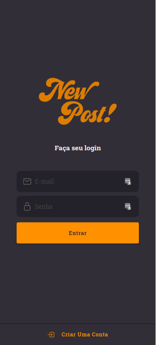
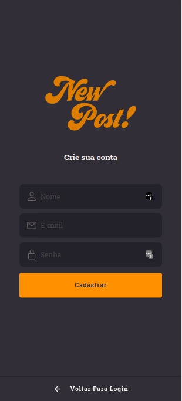
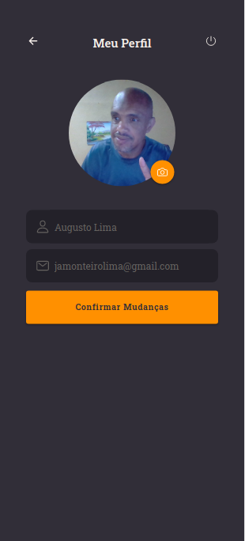
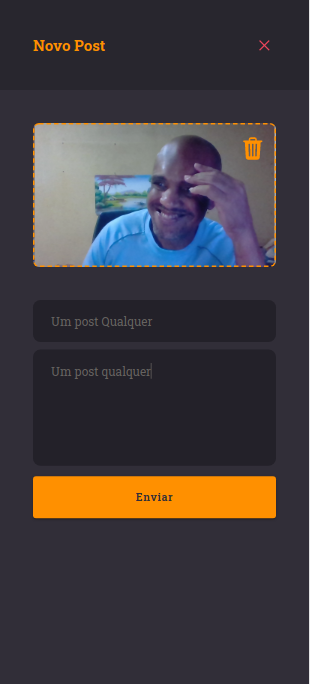
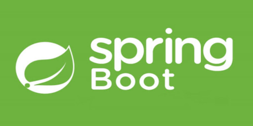
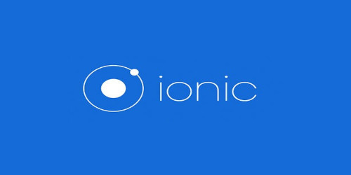

# AppPosts

    
  

## Tópicos

[Sobre o AppPost](#sobre-o-appposts)

[Tecnologias](#tecnologias)

[Licença](#licença)

 

## Sobre o AppPosts

O AppPosts é um sistema de posts, com o mesmo conceito do Facebook ou Instagram, foi criado com o objetivo de fixar conceitos de Spring Boot com Mongo DB no backend, e Ionic no Fronted

 

## Versão mobile

  
    
   
   
   
   

 

## Tecnologias

  
    
   
  

Tecnologias e ferramentas utilizadas no desenvolvimento do projeto:

- [https://spring.io/projects/spring-boot](https://nextjs.org/)
- [TypeScript](https://www.typescriptlang.org/)
- [Ionic](https://ionicframework.com/)
- [VS Code](https://code.visualstudio.com/)
  - code --install-extension cweijan.vscode-database-client2
  - code --install-extension esbenp.prettier-vscode
  - code --install-extension GabrielBB.vscode-lombok
  - code --install-extension liviuschera.noctis
  - code --install-extension mwpb.java-prettier-formatter
  - code --install-extension Pivotal.vscode-boot-dev-pack
  - code --install-extension Pivotal.vscode-spring-boot
  - code --install-extension PKief.material-icon-theme
  - code --install-extension redhat.fabric8-analytics
  - code --install-extension redhat.java
  - code --install-extension VisualStudioExptTeam.vscodeintellicode
  - code --install-extension vscjava.vscode-java-debug
  - code --install-extension vscjava.vscode-java-dependency
  - code --install-extension vscjava.vscode-java-pack
  - code --install-extension vscjava.vscode-java-test
  - code --install-extension vscjava.vscode-maven
  - code --install-extension vscjava.vscode-spring-boot-dashboard
  - code --install-extension vscjava.vscode-spring-initializr

 

# Rodando a Aplicação Backend

- Apos instalar a extensões acima
  - Configurar a conexão do seu mongo db em `appposts/backend/src/main/resources/application.properties`
  - Abrir o projeto, no lado esquerdo clicar em Spring Boot Dashboard e depois em start
  - Instalar a extensão do vscode Thunder Client e import os arquivos de rotas em `appposts/backend/thunder-collection_[#APP-POSTS].json`
  - Você pode criar uma conta ou usar o usuário admin@email.com com a senha 1234 para iniciar a aplicação

# Rodando a Aplicação Frontend

- Abra a pasta `/appposts/frontend`
- yarn install
- ionic serve

## Licença

 

Esse projeto está sob a licença MIT. Veja o arquivo [LICENSE](/LICENSE) para mais detalhes.

---

Feito com :purple_heart: by [Augusto Monteiro](https://github.com/augustojaml)

